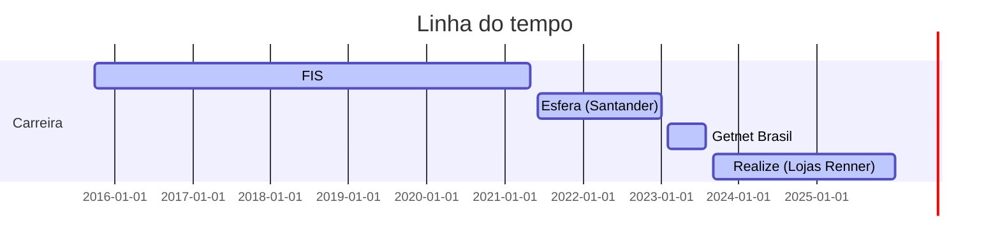

# Olá, i'm Gabriel

learn a little about my journey 😊

I have 8 years of experience in Fraud Prevention. In 2015/2021 I worked at FIS, where I was responsible for data analysis, preparation of fraud indicators, management presentations, creation of prevention strategy, creation and maintenance of systemic fraud rules. It was a great opportunity to develop my skills in analytical capacity, strategic vision of fraud prevention, maintenance of prevention system rules, and operations training.

Work experience with Fraud Prevention, fraud prevention projects, currently working as a Fraud Prevention Specialist: 

- Experience in Anti-Fraud systems (SRT, CPQD (Ynio) , Risk Center, Falcon); 
- Experience in data visualization (Tableau, Power BI); 
- Experience in data analysis; 
- Experience in ETL processes (Databricks); 
- Experience in anti-fraud implementation; 
- Experience in operations training. 

Solid experience in fraud analysis, KPIs, and prevention strategy. 

I am determined, enjoy learning new things, and have a quick learning ability. I am always open to new challenges.

Skills: Fraud Prevention / Python / SQL / Power BI / Databricks
  

 
   

----

## Atuação profissional

:computer: Fraud Prevention Specialist - Realize (Lojas Renner) (09.2023 - **)

:computer: Senior Fraud Prevention Analyst - Getnet Brasil (02.2023 - 08.2023)

:computer: Fraud Prevention Analyst - Esfera (Santander) (06.2021 - 01.2023)

:computer: Information Analyst - FIS (10.2015 - 05.2021)

## Formação Acadêmica

:newspaper_roll: Authorization Management - Mastercard Academy LAC (2024)

:newspaper_roll: Storytelling com dados - Mastercard Academy LAC (2024)

:newspaper_roll: Best Practices for Fraud Risk Management for Issuers - Mastercard Academy LAC (2024)

:newspaper_roll: Course Business Intelligence - FIAP (2021)

:newspaper_roll: Big Data and Analytical Intelligence - FCT/UNESP (2021 - 2023)
